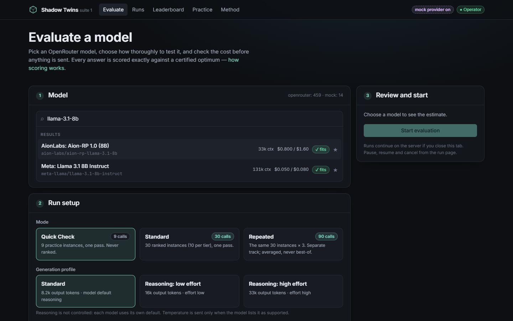
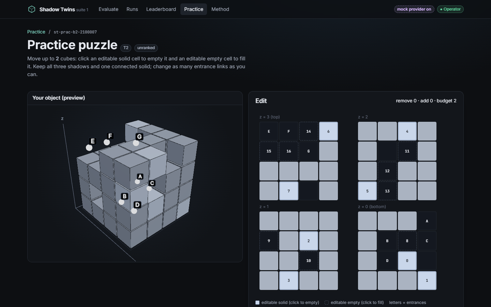
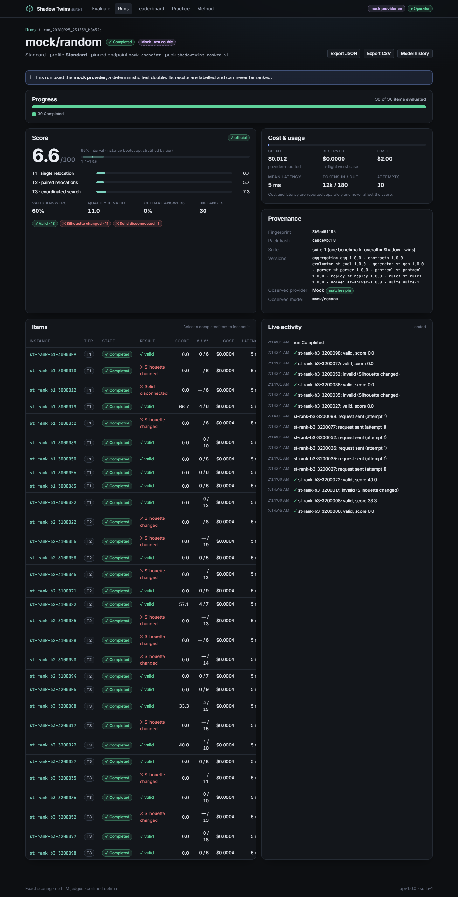
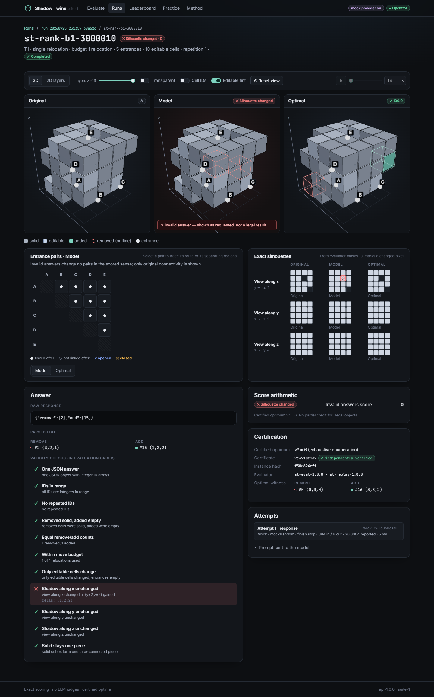

# Shadow Twins

**A compact, exactly scored LLM benchmark for 3D spatial reasoning, with a web app to run models
and inspect every answer in 3D.**


A model gets a short text description of a 4×4×4 voxel object and may relocate up to three cubes.
It must keep all three orthographic shadows identical and the solid in one piece, while changing as
many tunnel-entrance connections as possible. Every answer is scored `100 × v / v*` against an
**exhaustively certified optimum**.

- **Exact scoring.** No LLM judges, no rubric, and scores never come from a renderer. Partial
  credit is the fraction of the proven optimum the answer reaches.
- **Independently verifiable.** Every certificate is re-derived by a separate verifier (`stverify`)
  that imports no engine code. `just check` re-verifies all shipped packs.
- **Small and cheap.** 30 ranked instances, each prompt under 800 tokens on every tokenizer in the
  panel.
- **Full provenance.** Each run records pack hash, rule/parser/evaluator/solver versions, pinned
  vs. observed provider, cost and token usage, and can be exported and re-scored offline.

Suite 1 contains one benchmark, so the overall score equals the Shadow Twins score.

## The task

Each instance is a 4×4×4 grid with a solid object, 2–8 fixed **entrances** (empty boundary cells)
and a short list of **editable** cells, each with a numeric ID. The model answers with the IDs of
cubes to move:

```json
{"remove": [0], "add": [3]}
```

The resulting object is legal only if:

1. only editable cells changed and every entrance stays empty,
2. all three binary shadows (along x, y and z) are exactly unchanged, and
3. the solid is still one face-connected piece.

Two entrances are *linked* when a face-connected path of empty cells joins them inside the grid.
The objective `v` counts entrance pairs whose linked/unlinked status changed (opening and closing
both count). The score is `100 × v / v*` for a legal answer and `0` for any invalid one, which is
recorded with a category such as `silhouette_changed`, `solid_disconnected` or `malformed_json`.
The parser is strict: one JSON object (optionally in one code fence), no surrounding prose, no
repairs.

<details>
<summary>Example prompt (fixture <code>fx-shadow-gate</code>)</summary>

```text
Shadow Twins puzzle.
A 4x4x4 grid of cells (x,y,z), each coordinate 0-3. 1 = solid cube, 0 = empty.
Each line below is one layer z (z=0 bottom, z=3 top) and shows its rows y=0,1,2,3 from left to right; each row lists x=0,1,2,3 from left to right.
z=0 (bottom): 1111 1111 1111 1111
z=1: 1111 0001 1101 1101
z=2: 1111 1111 1010 1111
z=3 (top): 1111 1111 1111 1111
Entrances (fixed empty boundary cells): A(0,1,1) B(2,3,1) C(3,2,2)
Editable cells as id:(x,y,z).
Solid now: 0:(3,2,1) 1:(3,1,1)
Empty now: 2:(1,1,1) 3:(1,2,2)

A move takes the cube out of one solid editable cell and puts it into one empty editable cell. Make at most 1 move (zero is allowed); all moves happen at once. The result must keep:
1. Every non-editable cell unchanged.
2. The three shadows: every straight line of 4 cells parallel to the x, y or z axis contains a solid cube after the moves exactly when it did before.
3. All solid cubes as one piece joined through shared faces.
Two entrances are linked when a path of empty cells joins them, stepping only between cells that share a face and never leaving the grid.
Goal: change the linked/unlinked status of as many entrance pairs as possible (opening and closing both count).

Reply with only JSON: {"remove":[ids of solid cells to empty],"add":[ids of empty cells to fill]}. Both lists must have the same length. No moves: {"remove":[],"add":[]}
```

</details>

The normative definition, including coordinates, evaluation order and every answer category, is in
[docs/FORMAL_RULES.md](docs/FORMAL_RULES.md).

## Packs and baselines

| Pack | Instances | Use |
|---|---|---|
| `shadowtwins-ranked-v1` | 30 (10 per tier) | Ranked runs and the leaderboard |
| `shadowtwins-practice-v1` | 9 | Quick checks and the interactive practice page; never ranked |
| `shadowtwins-dev-v1` | 30 | Research and calibration only |

Tiers: **T1** single relocation, **T2** paired relocations, **T3** coordinated search. Packs are
frozen and hashed; changing the rules requires a version bump.

Deterministic baselines on the ranked pack (no LLM results are published yet):

| Tier | No-op | Random legal (exp.) | Random candidate (exp.) | Local search | Optimum |
|---|---:|---:|---:|---:|---:|
| T1 | 0.0 | 18.6 | 10.9 | 100.0 | 100.0 |
| T2 | 0.0 | 27.8 | 7.8 | 73.0 | 100.0 |
| T3 | 0.0 | 25.5 | 5.1 | 54.7 | 100.0 |
| **Pack (tier-equal)** | **0.0** | **24.0** | **8.0** | **75.9** | **100.0** |

Per-instance statistics: [docs/reports/PACKS_V1.md](docs/reports/PACKS_V1.md).

## The app

A single container serves the API, a durable worker and a React + three.js UI:

- **Evaluate** any [OpenRouter](https://openrouter.ai) or [Groq](https://groq.com) model with a
  cost estimate before anything is sent. Run modes are *Quick Check* (9 practice items, never
  ranked), *Standard* (30 ranked items) and *Repeated* (30 × 3, averaged, a separate track), each
  with a standard or reasoning (low/high effort) generation profile.
- **Runs** stream live progress, show the score with a 95% bootstrap interval stratified by tier,
  enforce a spending limit, and survive restarts. Pause, resume, cancel, and export to JSON or CSV.
- **Inspect** any answer next to the original and the certified optimum in synchronized 3D or 2D
  layer views, with entrance-pair connectivity, exact silhouette diffs and every validity check.
- **Practice** puzzles by hand, and read the scoring method in the app.
- A deterministic **mock provider** (`mock/optimal`, `mock/random`, `mock/refuse`,
  `mock/ratelimit`, …) for trying the app without an API key. Mock results are labelled
  everywhere and can never be ranked.

<details>
<summary>More screenshots</summary>

| Evaluate a model | Practice puzzle |
|---|---|
|  |  |
| **Run result** | **Inspecting an invalid answer** |
|  |  |

All screenshots: [docs/screenshots/](docs/screenshots/).

</details>

## Quick start (Docker)

Requires Docker with Compose.

```bash
cp .env.example .env    # set OPENROUTER_API_KEY and/or GROQ_API_KEY, and ST_OPERATOR_TOKEN
docker compose up -d    # builds the image on first run
```

Open `http://127.0.0.1:8000/#token=<your ST_OPERATOR_TOKEN>` once to sign in (or click **Viewer**
in the header and paste it).

- `ST_OPERATOR_TOKEN` is a password you choose. It unlocks starting runs. Generate one with
  `python -c "import secrets;print(secrets.token_urlsafe(24))"`.
- API keys stay on the server and are never sent to the browser. With `GROQ_API_KEY` set, Groq
  models appear next to OpenRouter's, marked **Groq** (free plan by default).
- No API key? Add `ST_ENABLE_MOCK_PROVIDER=1` to `.env` to use the mock provider.
- Data, logs and backups live in the `shadowtwins-data` volume (`/data`). The port is bound to
  localhost; put a TLS proxy in front for remote access.

<details>
<summary>Without Compose</summary>

```bash
docker build -t shadowtwins:0.1.0 .
docker run -d --name shadowtwins -p 127.0.0.1:8000:8000 -v shadowtwins-data:/data \
  --env-file .env --stop-timeout 40 shadowtwins:0.1.0
```

</details>

Configuration, auth modes, backup/restore and upgrades: [docs/OPERATIONS.md](docs/OPERATIONS.md).

## Reproduce a score without the app

```bash
uv run shadowtwins-verify packs/shadowtwins-ranked-v1           # re-derive every certificate
uv run benchserver export RUN_ID --format json -o run.json      # full provenance export
uv run benchserver reevaluate RUN_ID                            # re-score stored responses offline
```

## Development

Requirements: Python 3.12 with [uv](https://docs.astral.sh/uv/), Node 22 with pnpm 10, and
optionally [just](https://just.systems).

```bash
uv sync --extra research                            # Python env (+ tokenizer panel for pack tooling)
pnpm --dir frontend install
ST_ENABLE_MOCK_PROVIDER=1 uv run benchserver dev    # API + embedded worker on :8000
pnpm --dir frontend dev                             # UI on :5173 (proxies /api)
```

Checks (run locally; there is no CI):

```bash
just check          # ruff, pyright, pytest, contract drift, independent certificate re-verification
just frontend       # unit tests, build, Playwright end-to-end suite (incl. axe accessibility)
just docker-accept  # build the image and run the container acceptance gates
```

`just --list` shows every task.

### How it fits together

```
packs/ (frozen, hashed, independently verified)
  └─ benchcore.packs ──► SQLite (WAL) ◄── worker (leases, retries, cost reservations) ──► OpenRouter / Groq / mock
                            │                         └─ benchmark module: prompt → parse → validate → score
                            └──► FastAPI (/api, SSE) ──► React + three.js UI (same origin)
```

| Path | Contents |
|---|---|
| [`src/shadowtwins`](src/shadowtwins) | Rules, strict parser, evaluator, exhaustive solver, replays, generator, token panel, packs |
| [`src/stverify`](src/stverify) | Independent verifier (plain loops, no engine imports); `shadowtwins-verify` CLI |
| [`src/benchcore`](src/benchcore) | Benchmark interface, generic contracts, registry, aggregation and bootstrap intervals |
| [`src/benchserver`](src/benchserver) | API, durable worker, OpenRouter/Groq/mock adapters, exports, supervisor, CLI |
| [`frontend/`](frontend) | React/TypeScript/Vite, React Three Fiber views, Playwright suite |
| [`contracts/`](contracts) | JSON Schemas, OpenAPI, and formal fixtures covering every answer category |
| [`packs/`](packs) | Ranked, practice and dev packs with their certificates |
| [`tools/`](tools) | Pack pipeline, container acceptance, release check and pilot tooling |

## Documentation

| Topic | Documents |
|---|---|
| Rules and scoring | [FORMAL_RULES.md](docs/FORMAL_RULES.md) |
| Packs and admission | [ADMISSION_POLICY.md](docs/research/ADMISSION_POLICY.md), [PACKS_V1.md](docs/reports/PACKS_V1.md), [DEV_POOL_REPORT.md](docs/reports/DEV_POOL_REPORT.md) |
| Research design | [STUDY_PROTOCOL.md](docs/research/STUDY_PROTOCOL.md), [PILOT_REPORT.md](docs/research/PILOT_REPORT.md), [RELATED_WORK.md](docs/research/RELATED_WORK.md) |
| Backend and frontend | [BACKEND.md](docs/BACKEND.md), [FRONTEND.md](docs/FRONTEND.md) |
| Operations | [OPERATIONS.md](docs/OPERATIONS.md) |
| Release status | [RELEASE_CHECKLIST.md](docs/RELEASE_CHECKLIST.md), [KNOWN_ISSUES.md](docs/KNOWN_ISSUES.md) |
| Project history | [TRACKER.md](docs/TRACKER.md), [DECISIONS.md](docs/DECISIONS.md), [handoffs/](docs/handoffs/) |

## Status and limitations

Shadow Twins is **pre-release**. In particular:

- **No published model results yet.** The paid live pilot has not run, so the leaderboard is
  empty. Live runs so far used free OpenRouter and Groq models (see
  [KNOWN_ISSUES.md](docs/KNOWN_ISSUES.md)).
- **Novelty is unconfirmed.** The related-work search was scoped, not systematic
  ([RELATED_WORK.md](docs/research/RELATED_WORK.md)).
- **The packs are public** and may enter training data. No contamination resistance is claimed.
- **Strict format.** Models that write reasoning prose around the JSON answer score
  `malformed_json`. This is by design, but it can penalise some output styles.
- **No independent review** of the code or the research design has been performed yet.

The full list is in [docs/KNOWN_ISSUES.md](docs/KNOWN_ISSUES.md).

## Contributing

Issues and pull requests are welcome. Before opening a PR, run `just check` and `just frontend`.
The rules, parser, evaluator and solver are versioned: a change to anything in
[FORMAL_RULES.md](docs/FORMAL_RULES.md) needs a version bump in `src/shadowtwins/versions.py` and a
dated entry in [DECISIONS.md](docs/DECISIONS.md), because scores are only comparable when every
recorded version matches.

## License

No license has been chosen yet. Until one is added, all rights are reserved.
