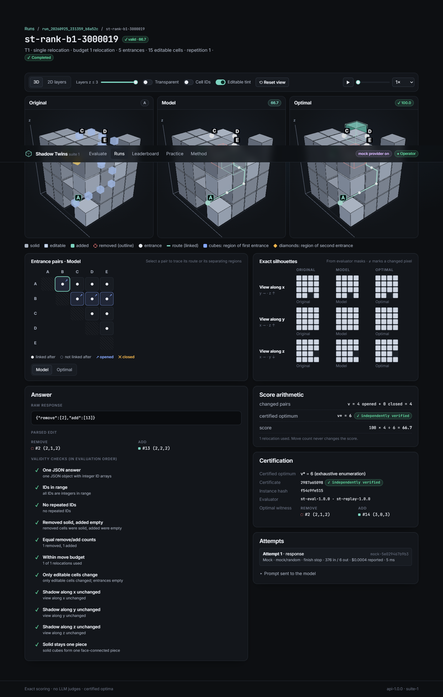

# Shadow Twins

A compact, exactly scored LLM benchmark with 3D inspection. A model gets a short text description
of a 4×4×4 voxel object and may relocate up to three cubes. It must keep all three orthographic
shadows identical and the solid in one piece while changing as many tunnel-entrance connections
as possible. Every answer is scored `100 × v / v*` against an exhaustively certified optimum:
no LLM judges, no renderer-derived scores.



Suite 1 contains one benchmark, so the overall score equals the Shadow Twins score. Novelty is
**unconfirmed** ([related work](docs/research/RELATED_WORK.md)).

## Run it (one container)

```bash
cp .env.example .env            # set OPENROUTER_API_KEY (and/or GROQ_API_KEY) and ST_OPERATOR_TOKEN
docker compose up -d            # or:
docker run -d --name shadowtwins -p 127.0.0.1:8000:8000 -v shadowtwins-data:/data \
  --env-file .env --stop-timeout 40 shadowtwins:0.1.0
```

Build the image first with `docker build -t shadowtwins:0.1.0 .`. `ST_OPERATOR_TOKEN` is simply a
password you make up (for example `python -c "import secrets;print(secrets.token_urlsafe(24))"`); it
unlocks starting runs. Sign in once with `http://127.0.0.1:8000/#token=<your token>` (or click
**Viewer** in the header and paste it). API keys
stay on the server. With `GROQ_API_KEY` set, Groq models (free plan by default) appear next to
OpenRouter's, marked **Groq**. Data, logs and backups live in the `/data` volume. Operations (configuration,
auth modes, backup/restore, upgrades): [docs/OPERATIONS.md](docs/OPERATIONS.md).

To try it without an OpenRouter key, add `ST_ENABLE_MOCK_PROVIDER=1` to `.env`. The `mock/*` test
doubles are labelled everywhere and can never be ranked.

## Develop

Requirements: Python 3.12 with [uv](https://docs.astral.sh/uv/), Node 22 with pnpm 10, and
optionally [just](https://just.systems).

```bash
uv sync --extra research                 # Python env (+ tokenizer panel for pack tooling)
pnpm --dir frontend install
ST_ENABLE_MOCK_PROVIDER=1 uv run benchserver dev   # API + embedded worker on :8000
pnpm --dir frontend dev                  # UI on :5173 (proxies /api)
just check                               # lint, types, 167 Python tests (+1 opt-in live), contract drift, certificate re-verification
just frontend                            # 44 unit tests, build, 10 Playwright e2e tests (incl. axe)
just docker-accept                       # build the image and run the 10 container gates
```

## How it fits together

```
packs/ (frozen, hashed, independently verified)
  └─ benchcore.packs ──► SQLite (WAL) ◄── worker (leases, retries, cost reservations) ──► OpenRouter / Groq / mock
                            │                         └─ benchmark module: prompt → parse → validate → score
                            └──► FastAPI (/api, SSE) ──► React + three.js UI (same origin)
```

| Path | What |
|---|---|
| `src/shadowtwins` | rules, strict parser, evaluator, exhaustive solver, replays, generator, token panel, packs |
| `src/stverify` | independent verifier (plain loops, no engine imports); `shadowtwins-verify` CLI |
| `src/benchcore` | benchmark interface, generic contracts, registry, aggregation and bootstrap intervals |
| `src/benchserver` | API, durable worker, OpenRouter, Groq and mock adapters, exports, supervisor, CLI |
| `frontend/` | React/TypeScript/Vite, React Three Fiber views, Playwright suite |
| `contracts/` | JSON Schemas, OpenAPI, and formal fixtures covering every answer category |
| `packs/` | `shadowtwins-ranked-v1` (30), `-practice-v1` (9), `-dev-v1` (30, research only) |

## Documentation

* Rules and scoring: [docs/FORMAL_RULES.md](docs/FORMAL_RULES.md)
* Packs, admission policy and baselines: [docs/research/ADMISSION_POLICY.md](docs/research/ADMISSION_POLICY.md),
  [docs/reports/PACKS_V1.md](docs/reports/PACKS_V1.md), [docs/reports/DEV_POOL_REPORT.md](docs/reports/DEV_POOL_REPORT.md)
* Research design: [docs/research/STUDY_PROTOCOL.md](docs/research/STUDY_PROTOCOL.md) · pilot:
  [docs/research/PILOT_REPORT.md](docs/research/PILOT_REPORT.md)
* Backend and runner: [docs/BACKEND.md](docs/BACKEND.md) · frontend: [docs/FRONTEND.md](docs/FRONTEND.md)
* Release status: [docs/RELEASE_CHECKLIST.md](docs/RELEASE_CHECKLIST.md) · known issues:
  [docs/KNOWN_ISSUES.md](docs/KNOWN_ISSUES.md)
* Project coordination (five-prompt tracker mirror, handoffs, decisions): [docs/TRACKER.md](docs/TRACKER.md),
  [docs/handoffs/](docs/handoffs/), [docs/DECISIONS.md](docs/DECISIONS.md)

## Reproduce a score without the app

```bash
uv run shadowtwins-verify packs/shadowtwins-ranked-v1           # re-derive every certificate
uv run benchserver export RUN_ID --format json -o run.json      # full provenance export
uv run benchserver reevaluate RUN_ID                             # re-score stored responses offline
```
